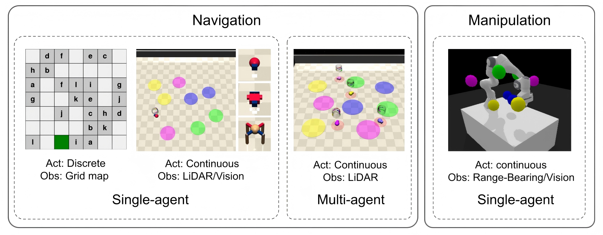

<div align="center">
<h1>
  SpecRLBench
</h1>
</div>

SpecRLBench is a benchmark suite for evaluating generalization in specification-guided reinforcement learning. It provides diverse navigation and manipulation environments across multiple difficulty levels, robot dynamics, and observation modalities.



## Installation
```bash
conda create -n specbench python=3.10
conda activate specbench
git clone https://github.com/BU-DEPEND-Lab/SpecRLBench.git
cd specbench
./install.bash
```

## Environments

### Navigation Tasks

**ID format**
```
{robot}LTL{level}{Vision}-v0.{suffix}
```

- `robot`: Point (easy) | Car (medium) | Ant (hard)  
- `level`: 0 (static) | 1 (1 moving zone/AP) | 2 (2 moving zones/AP)  
- `Vision`: optional first-person camera (default: LiDAR)  
- `suffix`: partial | overlap | partial_overlap (variants: partial observability and/or allowing zone overlap)

**Example**
```
CarLTL1Vision-v0.overlap
```
Car dynamics · 1 moving zone/AP · camera obs · overlapping zones

---

### Manipulation Tasks

**ID format**
```
PandaLTL{task}{level}Joints{Vision}-v0.{suffix}
```

- `task`: Reach (move end-effector to target)  
- `level`: 0 (end-effector only) | 1 (end-effector + arm)  
- `Vision`: optional RGBD cameras (default: distance obs)  
- `suffix`: partial  

**Example**
```
PandaLTLReach1Joints-v0.partial
```
Reach task · level 1 · joint control · distance obs · partial visibility


### Usage Example

The pre-defined environments follow the ID format described above and are listed in `test_env.py`. We also provide specification samplers; see `sampler/README.md` for details.

To customize an environment, users can define a configuration, which will be parsed to construct the corresponding environment. See `customize_env.py` for more information.

To use an environment for evaluation, see the example below:

```python
import specbench
import gymnasium as gym

env_id = "CarLTL1Vision-v0.overlap" # or some customized env
env = gym.make(env_id)

# spec = ...  # a given specification to be evaluated
obs, info = env.reset()

while True:
    act = env.action_space.sample()
    # or an action generated by your algorithm based on obs and spec

    obs, reward, terminated, truncated, info = env.step(act)

    # Current true propositions (for tracking spec progress)
    active_propositions = info["propositions"]

    if terminated or truncated:
        # or termination based on algorithm design, e.g., when the specification 
        # is satisfied by tracking the history of active_propositions
        break
    env.render()
```

## Reference

SpecRLBench builds upon and integrates components from the following projects: [Safety-Gymnasium](https://github.com/PKU-Alignment/safety-gymnasium/tree/main), [panda-gym](https://github.com/qgallouedec/panda-gym), [GenZ-LTL](https://github.com/BU-DEPEND-Lab/GenZ-LTL), [DeepLTL](https://github.com/mathiasj33/deep-ltl).

## License
SpecRLBench is released under Apache License 2.0.

